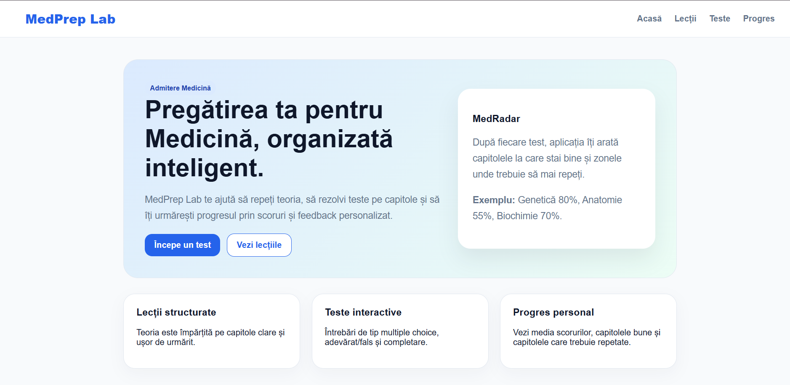

# MedPrep Lab

MedPrep Lab is an educational web platform built with **C#** and **ASP.NET Core Razor Pages**, designed to help students prepare for the Romanian Medical School admission exam.

The application combines structured theory, interactive quizzes, automatic scoring, detailed feedback, and progress tracking in one simple browser-based platform.

---

## Preview



---

## Project Purpose

The purpose of MedPrep Lab is to offer students a clear and organized way to study for medical school admission.

Instead of being only a simple quiz application, MedPrep Lab helps users:

- study theory by chapter;
- test their knowledge through different question types;
- receive instant feedback;
- identify strong and weak chapters;
- track progress over time.

The project was built with a focus on clean structure, object-oriented programming, data management, and a user-friendly interface.

---

## Main Features

- Structured lessons organized by chapter
- Educational content stored in JSON files
- Interactive quizzes
- Mixed tests and chapter-based tests
- Randomized questions
- Multiple question types:
  - multiple choice
  - true/false
  - fill-in-the-blank
- Automatic score calculation
- Detailed feedback after each test
- Progress dashboard
- JSON-based progress saving
- MedRadar system for identifying weak chapters
- Input validation and error handling
- Clean and responsive user interface

---

## Technologies Used

- C#
- ASP.NET Core Razor Pages
- HTML
- CSS
- JavaScript
- JSON
- Visual Studio 2022

---

## Project Structure

```text
MedPrepLab
│
├── Data
│   ├── lessons.json
│   ├── questions.json
│   └── progress.json
│
├── Enums
│   ├── DifficultyLevel.cs
│   ├── QuestionType.cs
│   ├── QuizMode.cs
│   ├── ResultStatus.cs
│   └── SubjectType.cs
│
├── Models
│   ├── AnswerOption.cs
│   ├── Lesson.cs
│   ├── Question.cs
│   ├── QuizResult.cs
│   ├── StudentProgress.cs
│   └── UserAnswer.cs
│
├── Services
│   ├── JsonDataService.cs
│   ├── LessonService.cs
│   ├── ProgressService.cs
│   ├── QuestionService.cs
│   └── QuizService.cs
│
├── Pages
│   ├── Lessons
│   ├── Quiz
│   ├── Progress
│   └── Index.cshtml
│
├── wwwroot
│   └── css
│       └── site.css
│
├── docs
│   └── images
│       └── home.png
│
├── Program.cs
└── README.md
```

---

## Application Architecture

The application is organized into separate folders in order to keep the code clean and easy to understand.

### Models

The `Models` folder contains the main classes used by the application.

Examples:

- `Lesson` represents a theory lesson.
- `Question` represents a quiz question.
- `AnswerOption` represents a possible answer.
- `QuizResult` stores the result of a completed quiz.
- `StudentProgress` stores the user's overall progress.

These classes help organize the data using object-oriented programming principles.

---

### Enums

The `Enums` folder contains fixed sets of values used in the application.

Examples:

- `DifficultyLevel` defines the difficulty of a lesson or question.
- `QuestionType` defines the type of question.
- `SubjectType` defines the subject.
- `ResultStatus` classifies the final result of a quiz.

Enums make the code easier to read and reduce the risk of invalid values.

---

### Services

The `Services` folder contains the main logic of the application.

Examples:

- `JsonDataService` reads and writes data from JSON files.
- `LessonService` manages lessons.
- `QuestionService` manages questions.
- `QuizService` checks answers and calculates scores.
- `ProgressService` saves and updates user progress.

This separation keeps the interface code cleaner and makes the application easier to maintain.

---

### Data

The `Data` folder stores the educational content and progress using JSON files.

- `lessons.json` contains the theory lessons.
- `questions.json` contains quiz questions.
- `progress.json` stores the user's quiz history and progress.

JSON was chosen because it is easy to read, easy to edit, and allows the educational content to be separated from the application logic.

---

## Quiz Logic

The user can start either a mixed test or a chapter-based test.

The questions are read from `questions.json`, then selected randomly. After the user submits the quiz, the application checks each answer using the `QuizService`.

The application supports:

- correct answer checking;
- empty answer handling;
- score calculation;
- result status classification;
- detailed explanations after the test.

If a user leaves an answer empty, the application does not crash. The unanswered question is treated as incorrect, and the platform continues normally.

---

## MedRadar

MedRadar is one of the original features of the project.

It analyzes the user's quiz results and identifies:

- the strongest chapter;
- the weakest chapter;
- the chapter that should be reviewed next.

This makes MedPrep Lab more than a basic quiz platform. It becomes a small personalized study assistant.

---

## Stability and Validation

The application includes validation and error handling to improve stability.

Examples:

- JSON files are checked before being read.
- `try-catch` blocks are used when reading and writing data.
- empty answers are handled safely;
- `int.TryParse` is used to avoid conversion errors.
- the user receives a warning if not all questions are answered.

These features prevent the application from crashing because of invalid or missing input.

---

## User Interface

The interface was built using Razor Pages, HTML, CSS, and a small amount of JavaScript.

The design includes:

- a clean navigation bar;
- card-based sections;
- clear buttons;
- medical-inspired colors;
- separated pages for lessons, quizzes, and progress;
- a responsive layout.

The main pages are:

- Home
- Lessons
- Quiz Setup
- Quiz Start
- Quiz Result
- Progress Dashboard

---

## How to Run the Project

1. Open the project in **Visual Studio 2022**.
2. Open the `MedPrepLab` solution.
3. Make sure the required .NET framework is installed.
4. Press the green `Run` button or select the `https` launch profile.
5. The application will open in your browser.

---

## Example User Flow

1. The user opens the homepage.
2. The user goes to the Lessons section.
3. The user reads a theory lesson.
4. The user starts a quick quiz or a mixed test.
5. The user answers the questions.
6. The application calculates the score.
7. The user receives detailed feedback.
8. The progress dashboard is updated.

---

## Future Improvements

Possible future improvements include:

- adding a countdown timer for admission simulations;
- exporting quiz results as PDF;
- adding a login system for multiple students;
- creating advanced progress charts;
- adding more lessons and questions;
- adding diagrams and images for each lesson;
- creating a full admission simulation mode;
- adding difficulty filters for quizzes.

---

## Educational Value

MedPrep Lab helps students learn actively instead of only reading theory.

The platform supports:

- self-assessment;
- revision by chapter;
- personalized feedback;
- progress monitoring;
- better organization of study sessions.

---

## Conclusion

MedPrep Lab is an educational web application that combines theory, testing, and progress analysis. The project uses object-oriented programming, JSON data storage, service-based logic, and a simple user interface to create a useful study tool for students preparing for medical school admission.
